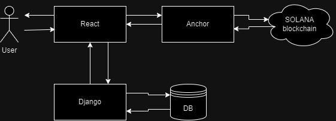

# Semestral Project Forecast

## Opis
Ten projekt jest semestralnym zadaniem, składającym się z części frontend, backend i solana blockchain. Celem projektu jest stworzenie pełnofunkcjonalnej aplikacji webowej przy użyciu nowoczesnych technologii.

# struktura:
# ├── backend/  # Część backend projektu
# │ ├── app.py  # Główny plik backend
# │ ├── requirements.txt # Zależności Python
# | ├── web3 monejbox # anchor smart contact
# │ └── ... # Inne pliki backend
# │
# ├── frontend/ # Część frontend projektu
# │ ├── src/ # Kod źródłowy frontendu
# │ │ ├── components/ # Komponenty React
# │ │ ├── App.js # Główny komponent aplikacji
# │ │ └── index.js  # Punkt wejścia do aplikacji
# │ ├── public/ # Pliki publiczne
# │ │ ├── index.html # Główny plik HTML
# │ │ └── ... # Inne pliki publiczne
# │ ├── package.json # Plik konfiguracyjny npm
# │ └── ... # Inne pliki frontendu
# │
# ├── node_modules/  # Katalog z zależnościami Node.js
# ├── .gitignore  # Plik do ignorowania plików w Git
# ├── .gitmodules  # Plik konfiguracji submodułów Git
# ├── package-lock.json # Plik blokowania zależności npm
# ├── package.json # Plik konfiguracyjny npm
# └── README.md # Plik z dokumentacją

# architektura


## Frontend
# Komponenty Transakcji 

## Opis
Komponenty transakcji w Forecast2 są zaprojektowane do zarządzania różnymi aspektami finansowymi aplikacji, takimi jak wydatki, dochody, historia transakcji, analiza i prognozowanie.

## Zawartość

### Expenses.jsx
Komponent odpowiedzialny za wyświetlanie i zarządzanie wydatkami użytkownika.

### Incomes.jsx
Komponent do wyświetlania i zarządzania dochodami użytkownika.

### History.jsx
Komponent do przeglądania historii transakcji.

### SendAnalitics.jsx
Komponent do wysyłania danych analitycznych.

### Transaction.jsx
Główny komponent transakcji, odpowiedzialny za wyświetlanie szczegółów transakcji.

### TransactionChart.jsx
Komponent do wizualizacji danych transakcji za pomocą wykresów.

### TransactionPredict.jsx
Komponent do prognozowania przyszłych transakcji na podstawie istniejących danych.

## Zależności
- `React`: Biblioteka do budowania interfejsów użytkownika.
- `axios`: Klient HTTP do komunikacji z backendem.
- `recharts.js`: Biblioteka do tworzenia wykresów.
- `moment`: Biblioteka do manipulacji datami i czasem.

# Komponenty Transakcji Kryptowalutowych 

## Opis
Komponenty transakcji kryptowalutowych w Forecast2 są zaprojektowane do zarządzania operacjami kryptowalutowymi, umożliwiając użytkownikom przeprowadzanie transakcji, przeglądanie historii oraz analizę operacji.

## Zawartość

### BankaComponent.jsx
Komponent odpowiedzialny za wyświetlanie informacji o bankach i interakcję z nimi w kontekście transakcji kryptowalutowych.

### BankaFunctions.jsx
Zbiór funkcji pomocniczych używanych w kontekście operacji bankowych związanych z kryptowalutami.

### CryptoTransactions.jsx
Główny komponent do zarządzania i wyświetlania transakcji kryptowalutowych.

### SendTransaction.jsx
Komponent umożliwiający użytkownikom wysyłanie kryptowalut do innych użytkowników.

## Zależności
- `React`: Biblioteka do budowania interfejsów użytkownika.
- `axios`: Klient HTTP do komunikacji z backendem.
- `chart.js`: Biblioteka do tworzenia wykresów.
- `moment`: Biblioteka do manipulacji datami i czasem.

## Przykład Użycia

### CryptoTransactions.jsx
```jsx
import React from 'react';
import CryptoTransactions from './CryptoTransactions';
```

## Komponent Calendar

### Przegląd
`Calendar.jsx` to komponent React, który wyświetla interfejs kalendarza z możliwością zarządzania wydarzeniami. Wykorzystuje `react-big-calendar` do widoku kalendarza oraz `moment.js` do obsługi dat.

### Zależności
- `react`, `react-dom`: Biblioteka React i narzędzia DOM.
- `react-big-calendar`: Dostosowywalny komponent kalendarza.
- `moment`: Biblioteka do obsługi dat.
- `sonner`: Biblioteka do powiadomień typu toast.
- Komponenty niestandardowe z `@/components/ui/` dla elementów interfejsu (Button, Input, Card).

### Użycie
Komponent pobiera wydarzenia z globalnego kontekstu za pomocą `useGlobalContext()`. Użytkownicy mogą przeglądać, dodawać i usuwać wydarzenia, wyświetlając powiadomienia toast.

### Używane komponenty
- `Calendar` z `react-big-calendar`: Renderuje interfejs kalendarza.
- `EventComponent`: Renderowanie pojedynczych wydarzeń z funkcjonalnością usuwania.

### Funkcjonalności
- **Renderowanie wydarzeń:** Wyświetla pobrane wydarzenia w kalendarzu.
- **Dodawanie wydarzeń:** Pozwala użytkownikom dodawać nowe wydarzenia.
- **Usuwanie wydarzeń:** Umożliwia usuwanie wydarzeń z kalendarza i wyświetlanie powiadomień toast.

# Dokumentacja dla komponentu Chat

## Przegląd
Komponent Chat umożliwia przesyłanie wiadomości w czasie rzeczywistym między użytkownikami przy użyciu technologii WebSocket. Integruje się z backendem API do zarządzania uwierzytelnianiem użytkowników, pobieraniem wiadomości oraz historią czatów.

## Zależności
- `React`: Biblioteka frontendowa do budowania interfejsów użytkownika.
- `moment`: Biblioteka do manipulacji datami i czasem.
- `axios`: Klient HTTP do wykonywania żądań API.
- `WebSocket`: Zapewnia pełnodupleksowe kanały komunikacyjne przez jedno połączenie TCP.

## Zmiennie stanu
- `realtimeMessages`: Przechowuje wiadomości otrzymywane w czasie rzeczywistym przez WebSocket.
- `receiverId`: ID odbiorcy wiadomości.
- `userData`: Informacje o bieżącym użytkowniku pobrane z backendu.
- `allUsers`: Dane wszystkich użytkowników.
- `chatHistory`: Wiadomości wymieniane w bieżącej sesji czatu.
- `chats`: Wszystkie dostępne sesje czatu.
- `page`: Bieżący numer strony do paginacji historii wiadomości.
- `nextPageExists`: Czy istnieją kolejne strony wiadomości do załadowania.
- `socketRef`: Referencja do połączenia WebSocket.
- `loading`: Czy wiadomości są obecnie ładowane.
- `chatsLoaded`: Czy historia czatu została załadowana.
- `chatId`: ID bieżącej sesji czatu.
- `message`: Tekst wiadomości do wysłania i powiązane szczegóły.

## Funkcje
- `scrollToBottom()`: Przewija kontener czatu do dołu, zapewniając widoczność najnowszych wiadomości.
- `scroll20MessagesBack()`: Przewija kontener czatu w górę o określoną liczbę wiadomości.
- `handleInputChange(e)`: Aktualizuje stan wiadomości po zmianie wartości pola wejściowego.
- `handleSendClick()`: Wysyła bieżącą wiadomość przez WebSocket, jeśli połączenie jest otwarte.
- `handleReceiverChange(e)`: Aktualizuje ID odbiorcy i znajduje odpowiednią sesję czatu.
- `loadMoreMessages()`: Ładuje dodatkowe wiadomości z backendu po przewinięciu użytkownika na górę kontenera czatu.
- `groupMessagesByDate(messages)`: Grupuje wiadomości według daty w celu wyświetlenia ich w porządku chronologicznym.
- `displayMessages()`: Renderuje wiadomości pogrupowane według daty z odpowiednim stylem.

## Integracja WebSocket
Komponent ustanawia połączenie WebSocket po wybraniu odbiorcy wiadomości (`receiverId`). Słucha przychodzących wiadomości, aktualizuje stan o nowe wiadomości i wysyła wiadomości wpisane przez użytkownika.

## Cykl życia i haki
- `useEffect` dla `userData.id`: Pobiera dane użytkownika i czatu, gdy `userData.id` się zmienia.
- `useEffect` dla WebSocket: Zarządza połączeniem WebSocket, ładuje początkowe wiadomości i słucha przychodzących wiadomości.
- `useEffect` dla `IntersectionObserver`: Wykrywa, gdy użytkownik przewija do góry, aby załadować więcej wiadomości.

## Obsługa błędów
- Obsługuje błędy podczas pobierania danych lub nawiązywania połączeń WebSocket.
- Rejestruje błędy w konsoli w celu debugowania.

## Rozważania dotyczące wydajności
- Efektywnie zarządza ładowaniem i renderowaniem wiadomości, zapewniając płynne działanie aplikacji.
- Wykorzystuje paginację do ograniczenia liczby pobieranych i wyświetlanych wiadomości jednocześnie.

## Przykład użycia

```jsx
import React from 'react';
import Chat from './Chat';

function App() {
  return (
    <div className="App">
      <Chat />
    </div>
  );
}

export default App;
```

# usePubkey Hook w Forecast2

## Opis
`usePubkey` to niestandardowy hook React, zaprojektowany do obsługi operacji ta stworzenie tranzakcji cryptowaluty związanych z kluczem publicznym użytkownika. Hook umożliwia pobieranie, zapisywanie i zarządzanie kluczem publicznym w aplikacji.

## Zależności
- `React`: Biblioteka do budowania interfejsów użytkownika.
- `axios`: Klient HTTP do komunikacji z backendem.
- `@/context/GlobalContext`: Kontekst do zarządzania globalnym stanem aplikacji.

## Funkcjonalności
- **Pobieranie klucza publicznego:** Umożliwia pobieranie klucza publicznego z serwera.
- **Zapisywanie klucza publicznego:** Umożliwia zapisywanie nowego klucza publicznego.
- **Zarządzanie stanem klucza publicznego:** Przechowuje i zarządza stanem klucza publicznego w kontekście aplikacji.

## Użycie
### Przykład użycia
```jsx
import React from 'react';
import usePubkey from './usePubkey';

function PublicKeyManager() {
  const { pubkey, setPubkey, savePubkey } = usePubkey();

  const handleSave = () => {
    savePubkey(pubkey);
  };

  return (
    <div>
      <input 
        type="text" 
        value={pubkey} 
        onChange={(e) => setPubkey(e.target.value)} 
      />
      <button onClick={handleSave}>Save Public Key</button>
    </div>
  );
}

export default PublicKeyManager;
```


________________________________________________________________________________________________

## Backend
### Główne funkcje

1. **Rejestracja użytkowników**
   - **URL:** `/users/signup/`
   - **Metoda:** POST
   - **Opis:** Rejestracja nowego użytkownika, tworzenie konta.

2. **Logowanie użytkowników**
   - **URL:** `/users/login/`
   - **Metoda:** POST
   - **Opis:** Uwierzytelnianie użytkownika, udostępnianie tokenu dostępu.

3. **Zarządzanie transakcjami**
   - **URL:** `/transactions/`
   - **Metoda:** GET, POST, PATCH, DELETE
   - **Opis:** Pobieranie listy transakcji, tworzenie nowych, aktualizacja istniejących oraz usuwanie transakcji.

4. **Zarządzanie wydarzeniami**
   - **URL:** `/events/`
   - **Metoda:** GET, POST, PATCH, DELETE
   - **Opis:** Pobieranie listy wydarzeń, tworzenie nowych, aktualizacja istniejących oraz usuwanie wydarzeń.
________________________________________________________________________________________________
## Solana Smart Contract

Ta cześć projektu semestralnego ma w sobie smart kontrakt, który jest napisany na blockchainie Solana.
Sens tego smart kontraktu polega na tym, że użytkownik może stworzyć swoją skarbonkę.


### **Project specifications**

**Technologies:**

Rust 1.75.0 (Program)

TypeScript 4.3.5 (Tests)

**Dependencies:**

(Program)\
anchor-lang = "0.27.0"\
solana-program = "=1.17.0"\
\
(Tests)\
"@coral-xyz/anchor": "^0.27.0",\
"@solana/wallet-adapter-wallets": "^0.19.32"


## Functions

### create money box

```
    pub fn create(Parameters)
```


| Parameter | Type     | Description                |
| :-------- | :------- | :------------------------- |
| `ctx` | `Context<Create>` |  **Required** Lista kont które dotyczą funkcji `create` |
| `name` | `String` | **Required**. Nazwa skarbonki |
| `goal` | `u64` | **Required**. Cel koncowa |

\
Funkcja ```create``` inicjalizuje nową skarbonkę. Ustawia początkowe wartości dla konta skarbonki (money_box), w tym nazwę, cel oraz administratora (którym jest użytkownik wywołujący tą funkcję).\
Funkcja ustawia admina na adres użytkownika, nazwę skarbonki na podaną nazwę, cel finansowy na podaną wartość, oraz początkowy balans na 0.

### donate to money box

```http
  pub fn donate(Parameters)
```

| Parameter | Type     | Description                       |
| :-------- | :------- | :-------------------------------- |
| `ctx`      | `Context<Donate>` | **Required**. Lista kont które dotyczą funkcji `donate` |
| `amount`      | `u64` | **Required**. Kwota do wpłaty |

Funkcja donate umożliwia użytkownikowi przekazanie darowizny na rzecz skarbonki.\
Funkcja tworzy instrukcję transferu z konta darczyńcy (donater) na konto skarbonki (money_box) i wywołuje tę instrukcję, aby przenieść środki.

### withdraw from money box

```http
  pub fn withdraw(Parameters)
```

| Parameter | Type     | Description                       |
| :-------- | :------- | :-------------------------------- |
| `ctx`      | `Context<Withdraw>` | **Required**. Lista kont które dotyczą funkcji `withdraw`|
| `amount`      | `u64` | **Required**. Kwota do wypłaty |
    
Funkcja withdraw pozwala administratorowi skarbonki na wypłatę środków.\
Funkcja sprawdza, czy użytkownik wywołujący funkcję jest administratorem skarbonki.\
Następnie sprawdza, czy skarbonka ma wystarczająco dużo środków po odjęciu minimalnego wymaganego salda na pokrycie czynszu.\
Jeżeli warunki są spełnione, przenosi określoną kwotę z konta skarbonki na konto odbiorcy.
## Deployment

Projekt już istnieje w [Solana devnet](explorer.solana.com/?cluster=devnet)
program_id tego smart kontraktu jest: 
```BBWxojjkikdbGWPQThCDSC7tHP5AYc6GMPcsNRPvzAjP```

[Link do naszego smart kontraktu na Solana Explorer](https://explorer.solana.com/address/BBWxojjkikdbGWPQThCDSC7tHP5AYc6GMPcsNRPvzAjP?cluster=devnet)


## Running Tests

Do uruchomenia testów:

```bash
  anchor test
```

